% APIT - Java recap etc
% Dr. Simon Rogers
% 29/12/2018

# Overview

- Introduction
- Objects, interfaces etc
- Immutable objects
- Call by reference / value
- Final
- Testing
- Documenting
- Tools

----

# Programming

## Compiling and running Java from the command line

- I will do this in class
- In simplest case, it involves two steps:
	- Compiling: `javac MyClass.java`
	- Running: `java MyClass`
- We will see some more complex examples throughout the course
- Feel free to use Eclipse if you prefer
- Also, Visual Studio Code...

----

## Organising projects

- All the programs in this course involve small numbers of classes
- For larger projects, it is important to organise all your files in a standard manner
	- Eclipse does this automatically
- If you want to do it manually, good description is available [here](http://cs.lmu.edu/~ray/notes/largejavaapps/)

----

## Classes

- Classes define objects
- `Pet` is a simple class used by `PetTest`
- Classes allow us to neatly combine related attributes and methods

----

## Inheritance

- One of the big strengths of OOP is *inheritance*
	- Creating classes that *inherit* everything of another class and add more
	- e.g. `Dog`, `Goldfish`, `PetInheritanceTest`
- In this example we also see `overridden` methods
	- `Dog` and `Goldfish` override the `description` method
	- The loop does not care which subclass the objects belong to.
	- This is very useful in many applications - *polymorphism*

----

## Abstract Classes

- Standard classes can be *instantiated*
	- i.e. we can create objects of their type (e.g. `Pet`, `Dog`, etc)
- Java allows you to define classes that cannot be instantiated: **Abstract classes**
- Abstract classes can only be sub-classed
	- e.g. `AbstractPet`, `Cat` and `AbstractPetTest`
- There is no situation where you would *have* to use an abstract class but many where it's neater
- Note that sub-classes have to implement all abstract methods or be abstract themselves

----

## Interfaces

- Interfaces are similar to abstract classes but:
	- Cannot have fields (unless they are `static` and `final`)
- See `InterfacePet`, `Parrot` and `TestInterfacePet`
- Interfaces are like contracts: they just specify the methods a class must implement
	- Note that methods in interfaces are abstract by default
- Note:
	- Classes can only sub-class one class...
	- ...but can implement many interfaces

# Some odds and ends

## `public`, `private` and `protected`

- Fields/attributes and methods are either public, private, or protected
	- Public: anything can access
	- Private: only objects of this type can access
		- e.g. `provideBone` method in `Dog`
	- Protected: only objects of this type, sub-classes (and other things within the same package)
		- e.g. `name` and `age` in `Pet` and `AbstractPet`
- In general, be as restrictive as possible.
 
----

## `static`

- Fields and methods can also be declared `static`
- This means that they are accessible without an object being instantiated
- Useful for storing generic methods and constants
- e.g. `MyMath` and `MyMathTest`
	- `areaOfCircle` is used without creating a `MyMath` object
	- Another static thing is used here - what is it?

----

## `static` attributes

 - Static attributes within an object are *shared* by all instances
 - Change the value in one, and it will change in all of the others...
 	- Useful, but not always the neatest solution

----

# Memory in Java

- Most data in Java is stored in Objects
- Objects are stored in an area of memory called the *heap*
	- There is one heap for the whole program
- Each thread has its own stack
	- All programs have at least one thread
	- In your programmes so far, there is one thread

----

## The Stack

- The stack is used for three purposes:
	- Evaluating expressions
	- Storage of local variables (variables in the current *scope*)
	- Management of method calls
- Think of it as a stack of paper.
	- Pieces of paper are put on (pushed), and taken off (popped), the top of the pile
	- LIFO: Last In First Out

----

## The Heap

- The heap is an area of memory used to store objects in Java
- Objects in the heap are accessible from any part of the program that has a local reference to the object
- Threads share a single heap
	- i.e. each thread can access objects in the heap
	- Useful, but causes all of the multi-threading problems we wil see
- In Java, objects are stored in the heap, references to objects are stored in the stack
	- This is very important, and we will come back to it later...

----

## Garbage collection

- Java periodically deletes objects when they are not needed
- An object is not needed if it is *unreachable*
	- i.e. no references to it exist

----

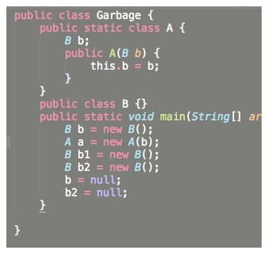

----

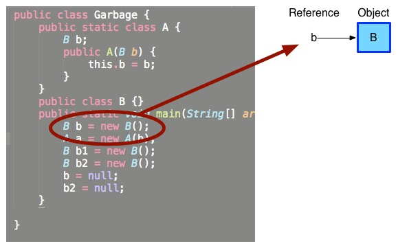

----

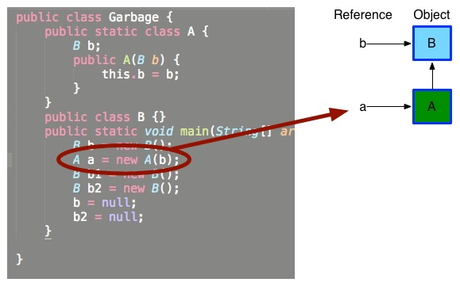

----

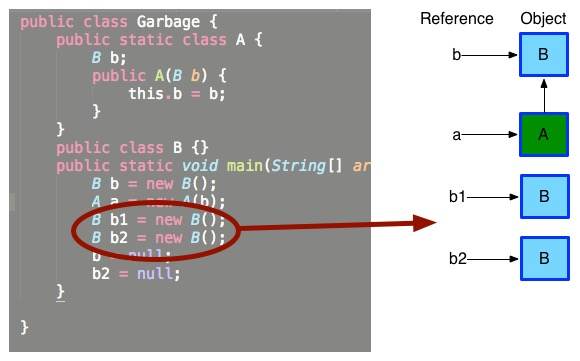

----

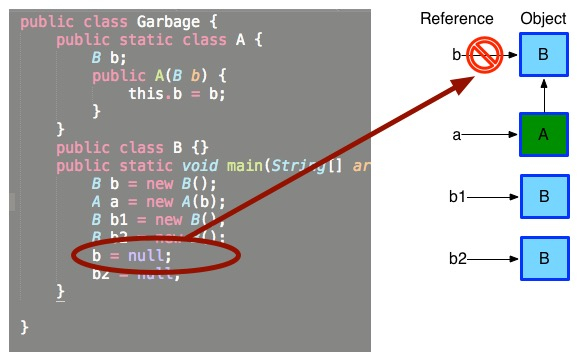

----

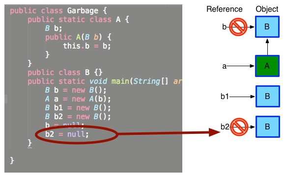

----

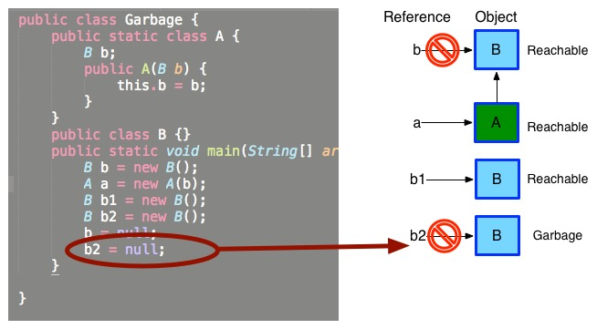

----

# Immutable objects

- Some native Java objects are *immutable*
- Once they are created they cannot be changed
	- e.g. String, Double, Float, Integer, etc
- It looks like we can change them?

~~~~{.java}
String a = "hello";
a+=" simon";
~~~~

- But, Java is creating a new object and storing the reference in `a`
	- Objects in heap, references in stack...
- See `StringExample`

----

# Call by value and call by reference

- Call by value
	- Value of a variable is passed to a method
	- Changes to the local copy are not reflected in the calling space
- Call by reference (e.g. C++)
	- Object references are passed to method
	- Actual object can be modified

----

----

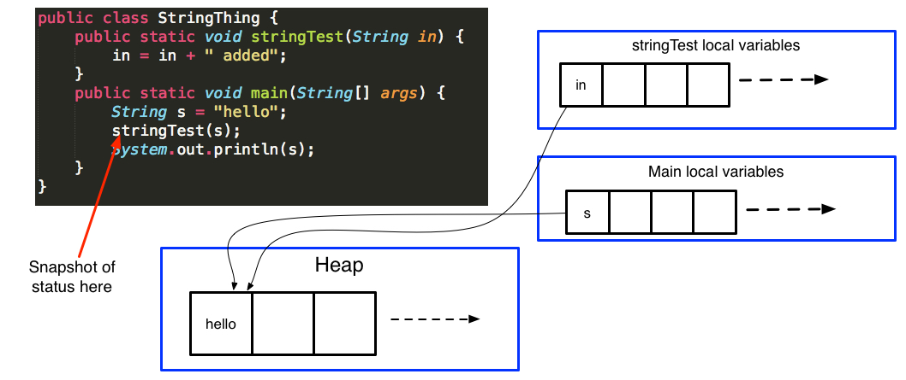

----

----

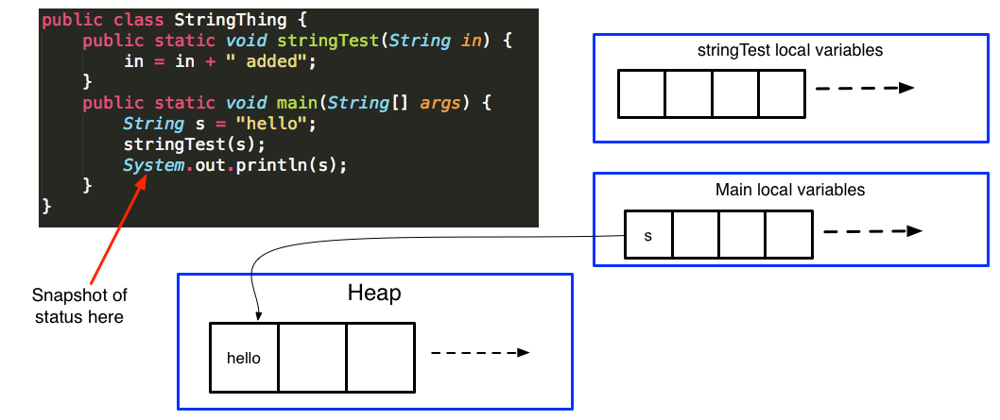

----

----

----

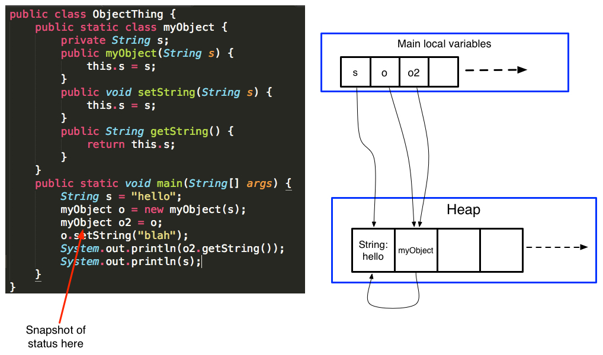

----

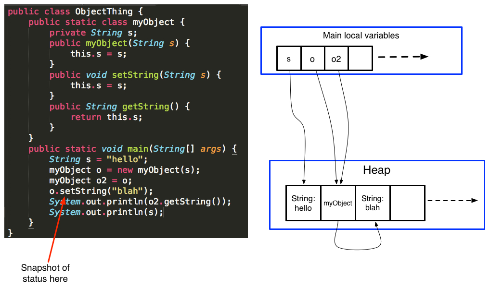

----

- In Java, numbers and object references are call by value. Note that there is a difference between:
	- Objects are passed by reference
	- Object references are passed by value
- Objects passed to a method can be modified, but creating new ones will not be reflected in the calling scope (the reference cannot change)
	- `CallExamples`
- Objects are stored in the heap, references to objects are stored in the stack

notesonly

~~~~ {.java}
public class CallExamples {
	public static class MyClass {
		int a = 0;
		public MyClass(int a) {
			this.a = a;
		}
		public int getValue() {
			return a;
		}
	}
	public static class DoubleClass {
		Double a = 0.0;
		public DoubleClass(Double a) {
			this.a = a;
		}
		public void multiply(Double m) {
			a = a * m;
		}
		public Double getValue() {
			return a;
		}
	}
	private static void aTest(MyClass in) {
		in = new MyClass(5);
	}

	private static void stringTest(String in) {
		in = in + " added";
		System.out.println(in);
	}

	private static void doubleTest(Double in) {
		in = in * 2;
	}
	private static void doubleObjectTest(DoubleClass in) {
		in.multiply(2.0);
	}

	public static void main(String[] args) {
		MyClass m = new MyClass(3);
		aTest(m);
		System.out.println(m.getValue());
		// What value will be displayed?

		String s = "hello";
		stringTest(s);
		System.out.println(s);
		// What will s be?

		Double d = 3.2;
		doubleTest(d);
		System.out.println(d);
		// What will d be?

		DoubleClass d2 = new DoubleClass(3.2);
		doubleObjectTest(d2);
		System.out.println(d2.getValue());
		// What will the value be?
	}
}
~~~~

In the first example, `main` creates an object of type `MyClass` (with value 3). The `aTest()` method is passed the value of the reference to the object (this sentence is important - make sure you understand it!). Inside the `aTest()` method it creates a new object and stores the reference in `in`. So, why don't we see the new object in `main`? It is because Java uses call by value for references and therefore changes to the value are not reflected in the calling scope. When `new` is invoked, the value of `in` changes, but this is the local `in`.

In the second example, we pass the string `"Hello"` to `stringTest`. `stringTest` appends `added` to the String. Why isn't this change seen in `main`? This time it is because String is an immutable type. When it looks like we're changing a String we're actually making a new object. The value of new object reference is stored in the local `in` variable and so isn't seen in `main`.

In the third example, we see the same behaviour, but this time with the immutable Double object instead of a String.

In the final example, we do see the value change reflected in `main`. This is because our `DoubleClass` is mutable. When we pass a `DoubleClass` object around, it's attributes can be changed as long as we never change the value of the reference (by, say, making a new object).

If you're struggling with this, keep in mind what a reference to an object is. Perhaps the best way to think of it is as the address of the bit of memory in which the object is stored. E.g. if you think of memory as a set of pigeon holes, then the reference stores which pigeon hole it is in. When we pass an object reference to a method, it creates its own local copy of the reference and therefore knows where the object is stored, and can  change it (assuming it permits changes). When a new object is created, it is put in a new pigeon hole and the local reference is changed (but not the original). So, in the first example above, the object referenced by `m` is left unchanged when `aTest()` creates a new object. The same thing is happening in examples 2 and 3, even though there is no `new` statement - because String and Double are immutable, new objects are made when we try and change them (see Figures below). In the final example, the reference never changes so the method can make changes to the original object.

endnotesonly

----

----

----

----

----

----

## Final

- It is good practice to make as many things `final` as possible
- Make as many attributes `final` as possible
- Stops other people doing bad things to your code
	- `final` classes can not be sub-classed
	- `final` methods can not be overloaded
	- `final` variables cannot be modified once declared
- `final` is not the same as `immutable`
- `FinalTest` and `FinalTestFixed`

notesonly

~~~~{.java}
public class FinalTest {
	public static final class Person {
		private String name;
		private Integer age;
		public Person(String name,Integer age) {
			this.name = name;
			this.age = age;
		}
		public void setName(String name) {
			this.name = name;
		}
		public void setAge(Integer age) {
			this.age = age;
		}
		public String getName() {
			return name;
		}
		public Integer getAge() {
			return age;
		}
	}
	public static void main(String[] args) {
		Person p = new Person("Ella",1);
		p.setAge(2);
		System.out.println(p.getName() + " is " + p.getAge());
	}
}
~~~~

Here, `Person` is a final class. But this does not mean that its attributes are immutable. You can see this as `main` can invoke methods that change the values of the `name` and `age` attributes. Remember that a class being `final` just means that it cannot be sub-classed (inherited). To make immutable classes, all attributes must be immutable (and no mutable objects must be returned). In this case, we change the attribute declarations to:

~~~~{.java}
private final String name;
private final Integer age;
~~~~

With this modification, the code will not even compile.

endnotesonly

----

# Some useful Java objects

## ArrayList

- Java arrays are of fixed length
- `ArrayList` gives you an object that can handle arrays of any object that change length

~~~~{.java}
ArrayList<Integer> a = new ArrayList();
a.add(3);
a.add(5);
System.out.println(a.contains(4)); // Checks is 4 is in a
~~~~

notesonly

Be careful of arraylists of integers. Various arraylist methods are overloaded to take an object or an integer as the argument (e.g. remove()). This can get very confusing!

endnotesonly

----

## HashSet

- Useful way of keeping a set of objects together (not ordered)

~~~~{.java}
	HashSet<String> h = new HashSet<String>();
	h.add("hello");
	h.add("simon");
	h.add("hello"); // Wont add as already in there
	h.contains("hello"); // returns true
	h.remove("simon"); // removes this one
~~~~

- Very fast for checking if an item is in the set

----

## HashMap

- Useful way of storing key,value pairs

~~~~{.java}
	HashMap<String,Double> h = new HashMap<String,Double>();
	h.put("banana",3.0);
	h.put("apple",2.0);
	System.out.println(h.get("apple")); //print 2
	h.keySet(); // Returns a set of the keys
~~~~

- Very fast for obtaining items for a particular key

----

# Hashing

- Hashing solves the problem of *efficiently* finding items in some collection
- We'll use the example of storing a phonebook. E.g. we want to store the following:
	- Simon, 0777777777
 	- Jennifer, 0666677889
 	- Ravi, 056782776
 	- Ken, 0447838827
 	- Hannah, 066848382

----

- The simplest solution would be to create two arrays (forget the problem of parallel arrays for now)
- Then, to find the number for a particular person, we loop through the array of names
- `PhoneBook1.java`

----

notesonly

~~~~{.java}

import java.util.ArrayList;
public class PhoneBook1 {
    private ArrayList<String> names;
    private ArrayList<String> numbers;
    public PhoneBook1() {
        names = new ArrayList<String>();
        numbers = new ArrayList<String>();
    }    
    public void addEntry(String name, String number) {
        names.add(name);
        numbers.add(number);
    }
    public String getNumber(String name) {
        for(int i=0;i<names.size();i++) {
            if(names.get(i).equals(name)) {
                return numbers.get(i);
            }
        }
        return ""; // If name doesn't exist
    }

    public static void main(String[] args) {
        PhoneBook1 p = new PhoneBook1();
        p.addEntry("Simon", "0777777777");
        p.addEntry("Jennifer", "0666677889");
        p.addEntry("Ravi", "056782776");
        p.addEntry("Ken", "0447838827");
        p.addEntry("Hannah", "066848382");

        System.out.println(p.getNumber("Ravi"));
    }
}

~~~~

endnotesonly

- In general looping over all entries will be slow (if lots of entries)
- A solution:
	- Assume no name longer than 15 characters
	- Create two arrays as before
	- Store the name and number in the nth position, where n = length of the name
	- `PhoneBook2.java`

notesonly

~~~~{.java}

public class PhoneBook2 {
    private String[] names = new String[15];
    private String[] numbers = new String[15];
    public void addEntry(String name,String number) {
        int l = name.length();
        names[l] = name;
        numbers[l] = number;
    }
    public String getNumber(String name) {
        int l = name.length();
        return numbers[l];
    }

    public static void main(String[] args) {
        PhoneBook2 p = new PhoneBook2();
        p.addEntry("Simon", "0777777777");
        p.addEntry("Jennifer", "0666677889");
        p.addEntry("Ravi", "056782776");
        p.addEntry("Ken", "0447838827");
        p.addEntry("Hannah", "066848382");

        System.out.println(p.getNumber("Ravi"));
    }
}

~~~~

endnotesonly

- This is much quicker as we can jump directly to the correct array position.
- It is a simple example of *hashing*
- In general, hashing is a way of mapping an object to a position in an array that enables finding it quickly
- A *hash function* is the function used to map from the object to the position
- In this example, the object is a `String` and the function simply computes its length

----

## Collisions

- What will happen if we have two names of the same length?
- A *collision*, and our simple program will fail
- Solution: maintain a list at each array position
- `PhoneBook3.java`

notesonly

~~~~{.java}

import java.util.ArrayList;
public class PhoneBook3 {

    // Inner class that holds one array entry...
    private class PhoneList {
        private ArrayList<String> names = new ArrayList<String>();
        private ArrayList<String> numbers = new ArrayList<String>();
        public void addEntry(String name,String number) {
            names.add(name);
            numbers.add(number);
        }
        public String getNumber(String name) {
            for(int i=0;i<names.size();i++) {
                if(names.get(i).equals(name)) {
                    return numbers.get(i);
                }
            }
            return "";
        }
    }
    private PhoneList[] mainList = new PhoneList[15];
    public PhoneBook3() {
        for(int i = 0;i<15;i++) {
            mainList[i] = new PhoneList();
        }
    }
    public void addEntry(String name, String number) {
        int l = name.length();
        mainList[l].addEntry(name, number);
    }
    public String getNumber(String name) {
        int l = name.length();
        return  mainList[l].getNumber(name);
    }

    public static void main(String[] args) {
        PhoneBook3 p = new PhoneBook3();
        p.addEntry("Simon", "0777777777");
        p.addEntry("Jennifer", "0666677889");
        p.addEntry("Ravi", "056782776");
        p.addEntry("Ken", "0447838827");
        p.addEntry("Hannah", "066848382");

        System.out.println(p.getNumber("Ravi"));
    }
}

~~~~

endnotesonly

- Final problem is what to do if a name is longer than 15?
- Solution:
	- Fix the max length of array (e.g. 6)
	- Store entries in the position length % 6
	- `PhoneBook4.java`

notesonly

~~~~{.java}

import java.util.ArrayList;
public class PhoneBook4 {

    // Inner class that holds one array entry...
    private class PhoneList {
        private ArrayList<String> names = new ArrayList<String>();
        private ArrayList<String> numbers = new ArrayList<String>();
        public void addEntry(String name,String number) {
            names.add(name);
            numbers.add(number);
        }
        public String getNumber(String name) {
            for(int i=0;i<names.size();i++) {
                if(names.get(i).equals(name)) {
                    return numbers.get(i);
                }
            }
            return "";
        }
    }
    private PhoneList[] mainList = new PhoneList[15];
    private static final int MAX_LENGTH = 6; // Change here...
    public PhoneBook3() {
        for(int i = 0;i<MAX_LENGTH;i++) {
            mainList[i] = new PhoneList();
        }
    }
    public void addEntry(String name, String number) {
        int l = name.length() % MAX_LENGTH; // Change here...
        mainList[l].addEntry(name, number);
    }
    public String getNumber(String name) {
        int l = name.length() % MAX_LENGTH; // Change here...
        return  mainList[l].getNumber(name);
    }

    public static void main(String[] args) {
        PhoneBook3 p = new PhoneBook3();
        p.addEntry("Simon", "0777777777");
        p.addEntry("Jennifer", "0666677889");
        p.addEntry("Ravi", "056782776");
        p.addEntry("Ken", "0447838827");
        p.addEntry("Hannah", "066848382");

        System.out.println(p.getNumber("Ravi"));
    }
}

~~~~

endnotesonly

- This is the basics of hashing
- Length isn't a great hash function
	- Want something that will spread the objects fairly evenly over the array

----

## `hashCode()`

- All objects have a `hashCode()` method
- Here's equivalent code to Java's `String` hashCode function:

~~~~{.java}
public int hashCode() {
  int hash = 0;
  for (int i = 0; i < length(); i++) {
    hash = hash * 31 + charAt(i);
  }
  return hash;
}
~~~~

----

- You can overwrite `hashCode()` for your own objects
- By default the hashCode returns (roughly) the memory location of the object
- Note:
	- Two objects that are `equal` *must* have the same hash.
	- I.e. if `obj1.equals(obj2)` then `obj1.hashCode()` must equal `obj2.hashCode()` 
	- Why? Think about our hashing examples...

----

# Generics

## ArrayList

- What is the `<Double>` for in `ArrayList`?
- It is a `generic`
- i.e. `ArrayList` can work with any type (specified when you create it)
- You can make classes with generics too...

----

## Creating generic objects

~~~~{.java}
public class MyClass<T> {
	private T t;
	public MyClass(T t) {
		this.t = t;
	}
}
~~~~

- In the code above `T` can be any class
- Can also have multiple types in the definition (`<A,B,C,D>`)
- See `Dictionary.java`

notesonly

~~~~{.java}
import java.util.ArrayList;
// A hacky alternative to HashMaps to demonstrate
// making a class with generics
public class Dictionary<A,B> {
	private ArrayList<A> listA = new ArrayList<A>();
	private ArrayList<B> listB = new ArrayList<B>();
	public void add(A a,B b) {
		listA.add(a);
		listB.add(b);
	}
	public B getDefinition(A a) {
		int index = listA.indexOf(a);
		return listB.get(index);
	}
}
~~~~

~~~~{.java}
public class DictionaryTest {
	public static void main(String[] args) {
		Dictionary<String,Double> d = new Dictionary<String,Double>();
		d.add("apple",3.0);
		d.add("banana",2.5);
		System.out.println(d.getDefinition("banana"));

		// Can also make the reverse!
		Dictionary<Double,String> d2 = new Dictionary<Double,String>();
		d2.add(3.0,"apple");
		d2.add(2.5,"banana");
		System.out.println(d2.getDefinition(3.0));

	}
}
~~~~

endnotesonly

# Testing

## Unit testing

- Testing individual components (e.g. classes, methods) to see if they are fit for use
- Design a suite of tests that can be run every time objects are changed
- Separates testing from the classes themselves

----

## JUnit

- `JUnit` is a popular Java unit test framework
- A *test class* is created for each normal class
- We can then run `JUnit` and it will automatically perform the tests
- Easiest to do this directly in Eclipse

----

## `Pointless.java`

~~~~{.java}
public class Pointless {
	public int myInt;
	public Pointless(int n) {
		myInt = n;
	}
	public void increment() {
		myInt++;
	}
	public int getMyInt() {
		return myInt;
	}
}
~~~~

----

## Assertions

- Unit testing is done at compile time
- We might also want *runtime* checks
	- to catch runtime errors (e.g. based on input that is unknown at compile time)
- The naive way is through the use of `if` statements

----

~~~~{.java}
public class AssertionExample {
	private int myInt;
	public AssertionExample(int n) {
		myInt = n;
	}
	public void decrement(int d) {
		if(d>myInt) {
			// Cannot decrement!
			System.out.println("Can't decrement!!");
		}else {
			myInt = myInt - d;
		}
	}
	public static void main(String[] args) {
		new AssertionExample(5).decrement(10);
	}
}
~~~~

----

- Assertions are a neater way to achieve this
	- Cause the program to exit if the condition is not met
	- Can be switched on or off at runtime
		- e.g. switch between runtime and debugging

~~~~{.java}
public class AssertionExample2 {
	private int myInt;
	public AssertionExample2(int n) {
		myInt = n;
	}
	public void decrement(int d) {
		assert myInt >= d;
		myInt = myInt - d;
	}
	public static void main(String[] args) {
		new AssertionExample2(5).decrement(10);
	}
}
~~~~

----

- Running:

`java -enableassertions AssertionExample2`

- can also use `-ea`
- Try running with and without
- An alternative is to explicitly throw exceptions but..
	- Takes longer to write
	- Exceptions cannot be switched off at runtime (slows things down)

----

# JavaDoc

- It's very important to properly document your code
- Standard comments `//` `/*` are good
- Javadoc is better!
- [This]{http://agile.csc.ncsu.edu/SEMaterials/tutorials/javadoc/} is quite a good tutorial

----

# Things we are not covering here

## Testing

- We have only touched upon testing. It's very important! Those of you doing SE will cover it more there.
- Much software engineering is now done in a *test driven* manner.
	- First write test cases and then write code.
	- Stop coding when the test cases are finished.
	- Writing a good set of test cases is hard!

## Data structures

- We make use of Java objects (e.g. `ArrayList`) but we don't worry about how Java implements this
- We also don't worry too much about the efficiency of different data structures and algorithms
- Those of you in ADS will do lots of this

---

## Build systems

- Compiling from the command line is fine for simple projects
- But..when you have a more complex project with lots of *dependencies* things get very complex 
- Systems exist to help you with this
- Examples:
	- Maven (the current standard for Java)
	- ANT (older but still popular)
- See Tim Storer's ANT guide on Moodle

---

## Software Engineering

- Programming is only a small part of building software
- Engineering large software projects is hard (evidenced by the number of times they end badly)
- Youll get lots of SE in, erm, SE

